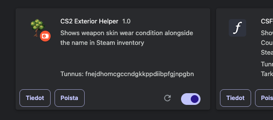
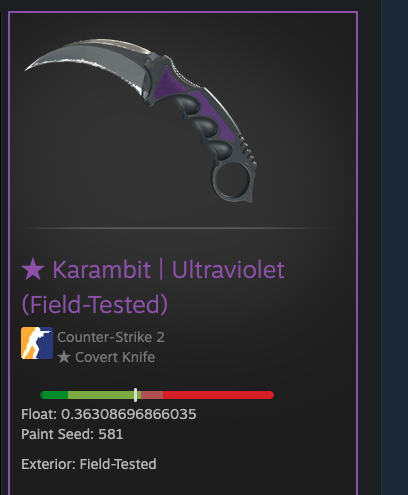

# cs2 Exterior Helper

This simple chrome extension moves the skin wear condition (exterior) next to the item name for easier look up

## How to add as the extension

Git clone the project using:
`https://github.com/oiva-r/cs2-exterior-helper.git`.

Go to `chrome://extensions` and enable the developer mode from the top right-hand corner.

After this click to "load unpacked" and choose the project folder.

